# Evaluación de Agentes de IA en Producción

### Del pánico a la confianza con AWS Bedrock

<div class="pt-12">
  <span class="text-xl">
    Hugo Jiménez
  </span>
  <div class="text-sm opacity-75 mt-2">
    ML Engineer @ Ravenpack | AWS User Group
  </div>
</div>

<div class="abs-br m-6 flex gap-2">
  <a href="https://github.com" target="_blank" class="text-xl slidev-icon-btn opacity-50 !border-none !hover:text-white">
    <carbon:logo-github />
  </a>
  <a href="https://linkedin.com" target="_blank" class="text-xl slidev-icon-btn opacity-50 !border-none !hover:text-white">
    <carbon:logo-linkedin />
  </a>
</div>

---
transition: fade-out
layout: two-cols
---

# La Evolución: Del RAG al Agente

## Chatbot RAG (Predecible)

<div v-click class="mt-8">


<div class="text-sm mt-4 opacity-75">
Solo lee y habla. Lo peor: mentir.
</div>

</div>

::right::

<div v-click class="mt-16">

## Agente IA (Caótico)

```mermaid {scale: 0.7}
graph TD
    A[Usuario] --> B[Agente]
    B --> C{Herramienta A?}
    C -->|Error| D[Re-intento]
    D --> E{Herramienta B?}
    E --> F[Acción]
    F -->|Loop?| B
    style B fill:#ff6b6b
    style F fill:#ff6b6b
```



<div class="text-sm mt-4 opacity-75">
Tiene manos. Puede ejecutar APIs, SQL, reservar vuelos.
</div>

</div>

---
layout: center
class: text-center
---

# ¿Qué puede salir mal?

<div class="grid grid-cols-3 gap-8 mt-16">

<div v-click class="p-6 border border-red-500 rounded-lg bg-red-500/10">
  <div class="text-4xl mb-4">🔁</div>
  <div class="font-bold text-lg mb-2">Loop Infinito</div>
  <div class="text-sm opacity-75">El agente intenta llamar a una API caída eternamente</div>
  <div class="text-xs mt-2 text-red-400">$$$ gastados en tokens</div>
</div>

<div v-click class="p-6 border border-orange-500 rounded-lg bg-orange-500/10">
  <div class="text-4xl mb-4">🎲</div>
  <div class="font-bold text-lg mb-2">Alucinación de Argumentos</div>
  <div class="text-sm opacity-75">Inventarse un ID de usuario que no existe</div>
  <div class="text-xs mt-2 text-orange-400">Data corruption</div>
</div>

<div v-click class="p-6 border border-yellow-500 rounded-lg bg-yellow-500/10">
  <div class="text-4xl mb-4">🎯</div>
  <div class="font-bold text-lg mb-2">Mala Selección</div>
  <div class="text-sm opacity-75">Usar search_weather cuando le pediste search_stock_price</div>
  <div class="text-xs mt-2 text-yellow-400">Wrong results</div>
</div>

</div>

<div v-click class="mt-12 text-xl">
  <span v-mark.underline.red>Evaluar la respuesta final no es suficiente.</span><br/>
  <span class="text-lg opacity-75">Tenemos que evaluar el <strong>proceso de pensamiento (The Trace)</strong>.</span>
</div>

---
layout: two-cols
layoutClass: gap-6
---

# La Solución: LLM-as-a-Judge

<div v-click class="mt-4">


</div>

<div v-click class="mt-4 p-3 bg-blue-500/10 border border-blue-500 rounded">
  <div class="font-bold mb-2 text-sm">El Juez verifica:</div>
  <ul class="text-xs space-y-1">
    <li>¿Eligió herramienta correcta?</li>
    <li>¿Parámetros válidos?</li>
    <li>¿Completó eficientemente?</li>
  </ul>
</div>

::right::

<div v-click class="mt-4">

## Ejemplo de Trace

```python {1-3|5-7|9-11|all}
# Input
query = "¿Mi pedido #12345?"

# Agente (malo)
thought: "Buscar pedidos"
action: search_orders()
parameters: {}

# Juez detecta
score: 2/5
reason: "Missing order_id"
```

</div>

<div v-click class="mt-4 text-xs opacity-75">
No revisamos logs manualmente.<br/>
Modelo potente audita rápido.
</div>

---
layout: center
---

# Arquitectura en AWS


<div v-click class="mt-8 grid grid-cols-4 gap-4 text-sm">

<div class="p-3 bg-orange-500/10 border border-orange-500 rounded text-center">
  <div class="font-bold">1. Agente</div>
  <div class="text-xs opacity-75">Bedrock</div>
</div>

<div class="p-3 bg-blue-500/10 border border-blue-500 rounded text-center">
  <div class="font-bold">2. Trace</div>
  <div class="text-xs opacity-75">Enable logging</div>
</div>

<div class="p-3 bg-purple-500/10 border border-purple-500 rounded text-center">
  <div class="font-bold">3. Evaluar</div>
  <div class="text-xs opacity-75">Lambda + Juez</div>
</div>

<div class="p-3 bg-green-500/10 border border-green-500 rounded text-center">
  <div class="font-bold">4. Visualizar</div>
  <div class="text-xs opacity-75">QuickSight/Pandas</div>
</div>

</div>

---
layout: two-cols
layoutClass: gap-6
---

# Métricas que Importan

<div class="mt-4">

## RAG Metrics (Antiguas)

<div class="text-xs opacity-75 space-y-1 mt-3">
  <div>✓ Faithfulness</div>
  <div>✓ Answer Relevance</div>
  <div>✓ Context Precision</div>
</div>

</div>

<div v-click class="mt-6 p-3 bg-red-500/10 border border-red-500 rounded">
  <div class="font-bold text-xs">❌ No sirven para agentes</div>
  <div class="text-xs opacity-75">Solo evalúan texto</div>
</div>

::right::

<div v-click class="mt-4">

## Agent Metrics (Nuevas)

<div class="space-y-2 mt-3">

<div class="p-2 bg-green-500/10 border border-green-500 rounded">
  <div class="font-bold text-xs">1. Tool Selection</div>
  <div class="text-xs opacity-75">¿Herramienta correcta?</div>
</div>

<div class="p-2 bg-blue-500/10 border border-blue-500 rounded">
  <div class="font-bold text-xs">2. Argument Validity</div>
  <div class="text-xs opacity-75">¿Parámetros válidos?</div>
</div>

<div class="p-2 bg-purple-500/10 border border-purple-500 rounded">
  <div class="font-bold text-xs">3. Steps to Solution</div>
  <div class="text-xs opacity-75">¿Eficiencia?</div>
</div>

</div>

</div>

---
layout: center
class: text-center
---

# Demo Time

<div class="text-2xl mt-12 opacity-75">
  Agente de Soporte en Bedrock
</div>

<div v-click class="mt-8 text-lg">
  <div class="mb-4">🎯 Objetivo: Consultar pedidos de clientes</div>
  <div class="mb-4">💣 Vamos a intentar romperlo</div>
  <div>🔍 Y luego evaluar automáticamente</div>
</div>

<div v-click class="mt-12 p-6 bg-orange-500/20 border border-orange-500 rounded-lg inline-block">
  <div class="text-sm font-bold mb-2">Cambio a IDE →</div>
  <div class="text-xs opacity-75">VS Code / Jupyter</div>
</div>

---
layout: two-cols
layoutClass: gap-4
---

# Demo: Flujo de Evaluación

<div class="mt-2 space-y-2">

<div v-click class="flex items-start gap-2">
  <div class="text-xl">1️⃣</div>
  <div>
    <div class="font-bold text-sm">Golden Dataset</div>
    <div class="text-xs opacity-75">Preguntas + herramienta esperada</div>
  </div>
</div>

<div v-click class="flex items-start gap-2">
  <div class="text-xl">2️⃣</div>
  <div>
    <div class="font-bold text-sm">Pregunta Trampa</div>
    <div class="text-xs opacity-75">"Pedido sin ID"</div>
  </div>
</div>

<div v-click class="flex items-start gap-2">
  <div class="text-xl">3️⃣</div>
  <div>
    <div class="font-bold text-sm">Ver el Trace</div>
    <div class="text-xs opacity-75">Logs locales</div>
  </div>
</div>

<div v-click class="flex items-start gap-2">
  <div class="text-xl">4️⃣</div>
  <div>
    <div class="font-bold text-sm">Ejecutar Juez</div>
    <div class="text-xs opacity-75">Script Python</div>
  </div>
</div>

</div>

::right::

<div v-click class="mt-2">

## Ejemplo de Output

```python
# Reporte
+-------+-------+----------+
| Query | Score | Issue    |
+-------+-------+----------+
| pedido| 2/5   | Missing  |
| sin   |       | order_id |
| ID    |       |          |
+-------+-------+----------+
```

<div class="mt-2 p-2 bg-red-500/10 border border-red-500 rounded text-xs">
  <div class="font-bold">El juez detectó</div>
  <div class="opacity-75">Agente sin ID</div>
</div>

</div>

<div v-click class="mt-2 text-xs opacity-75">
  Integra en CI/CD
</div>

---
layout: two-cols
layoutClass: gap-4
---

# Resultados y Costes

<div class="mt-2">

## La Realidad Económica

<div v-click class="mt-3 space-y-2">

<div class="p-2 bg-purple-500/10 border border-purple-500 rounded">
  <div class="font-bold text-xs">Claude Opus / GPT-4</div>
  <div class="text-xs opacity-75">💰 Preciso</div>
  <div class="text-xs mt-1">Golden Dataset</div>
</div>

<div class="p-2 bg-blue-500/10 border border-blue-500 rounded">
  <div class="font-bold text-xs">Claude Sonnet</div>
  <div class="text-xs opacity-75">💵 Balance</div>
  <div class="text-xs mt-1">Importante eval</div>
</div>

<div class="p-2 bg-green-500/10 border border-green-500 rounded">
  <div class="font-bold text-xs">Claude Haiku</div>
  <div class="text-xs opacity-75">🪙 Rápido</div>
  <div class="text-xs mt-1">CI/CD diario</div>
</div>

</div>

</div>

::right::

<div v-click class="mt-2">

## Estrategia


</div>

<div v-click class="mt-3 p-2 bg-yellow-500/10 border border-yellow-500 rounded">
  <div class="font-bold text-xs">Nota</div>
  <div class="text-xs opacity-75">
    Eval duplica inferencia.
    Usa Fast para volumen alto.
  </div>
</div>

---
layout: center
class: text-center
---

# Key Takeaways

<div class="grid grid-cols-3 gap-8 mt-16">

<div v-click class="p-6 border border-main rounded-lg">
  <div class="text-4xl mb-4">👁️</div>
  <div class="font-bold text-lg mb-3">Monitoriza Traces</div>
  <div class="text-sm opacity-75">Los agentes fallan en silencio. No evalúes solo el output final.</div>
</div>

<div v-click class="p-6 border border-main rounded-lg">
  <div class="text-4xl mb-4">⚖️</div>
  <div class="font-bold text-lg mb-3">Automatiza con LLM-as-a-Judge</div>
  <div class="text-sm opacity-75">Es la única forma de escalar sin revisar logs manualmente.</div>
</div>

<div v-click class="p-6 border border-main rounded-lg">
  <div class="text-4xl mb-4">☁️</div>
  <div class="font-bold text-lg mb-3">AWS Bedrock lo hace nativo</div>
  <div class="text-sm opacity-75">Traces integrados, herramientas de evaluación, o boto3 para control total.</div>
</div>

</div>

<div v-click class="mt-16 text-xl">
  Los agentes son el futuro,<br/>
  <span v-mark.underline.orange>pero solo si podemos confiar en ellos.</span>
</div>

<div v-click class="mt-8 text-lg opacity-75">
  La confianza se construye con métricas, no con fe.
</div>

---
layout: center
class: text-center
---

# ¿Preguntas?

<div class="mt-12 space-y-6">

<div v-click class="text-lg opacity-75">
  Algo que suelen preguntarme...
</div>

<div v-click class="p-6 bg-blue-500/10 border border-blue-500 rounded-lg inline-block text-left">
  <div class="font-bold mb-2">¿Cómo evalúo si la respuesta es segura/no tóxica?</div>
  <div class="text-sm opacity-75">
    → Usa <strong>Guardrails for Amazon Bedrock</strong><br/>
    → Detecta contenido dañino, PII, alucinaciones<br/>
    → Se integra nativamente en el flujo del agente
  </div>
</div>

</div>

<div class="mt-16 flex justify-center gap-4">
  <a href="https://github.com" target="_blank" class="p-3 border border-main rounded hover:bg-main/10 transition">
    <carbon:logo-github class="text-2xl" />
  </a>
  <a href="https://linkedin.com" target="_blank" class="p-3 border border-main rounded hover:bg-main/10 transition">
    <carbon:logo-linkedin class="text-2xl" />
  </a>
</div>

<div class="mt-8 text-sm opacity-50">
  Hugo Jiménez | ML Engineer @ Ravenpack
</div>
